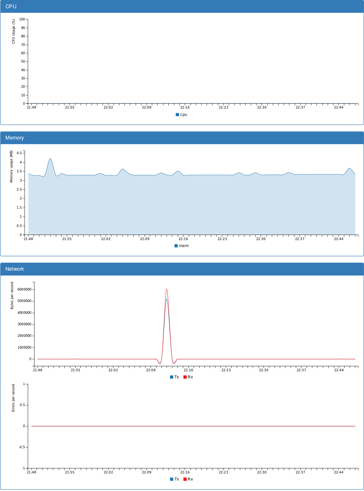

Oculus
======

A web dashboard for [Acadock](https://github.com/Scalingo/acadock-monitoring) docker container monitoring webservice. Celery workers consume periodically the live data of cpu/mem/net being used by the running docker containers, polling the Acadock API and storing the results in a redis. Flask, bootstrap and c3.js add some colour.

> This is obviously still a work in progress.



Architecture
------------

pass

Configuration
-------------

pass

Set Up The Environment
----------------------

Run **Acadock**:

```
 docker run -v /sys/fs/cgroup:/host/cgroup:ro         -e CGROUP_DIR=/host/cgroup \
            -v /proc:/host/proc:ro                    -e PROC_DIR=/host/proc \
            -v /var/run/docker.sock:/host/docker.sock -e DOCKER_URL=unix:///host/docker.sock \
            -p 4244:4244 --privileged --pid=host \
            --name acadock -d scalingo/acadock-monitoring
```

Run **Redis** (as a celery and timeseries backend):

```
 docker run --name redis -p 6379:6379 -d redis:3
```

Run **Celery** (workers and beat scheduler for periodical tasks):

```
 celery -A tasks worker --loglevel=info --beat
```

Run **Oculus**:

> (still working in a dockerized solution)
> python run.py

Then go to http://localhost:5000/container/:id 
